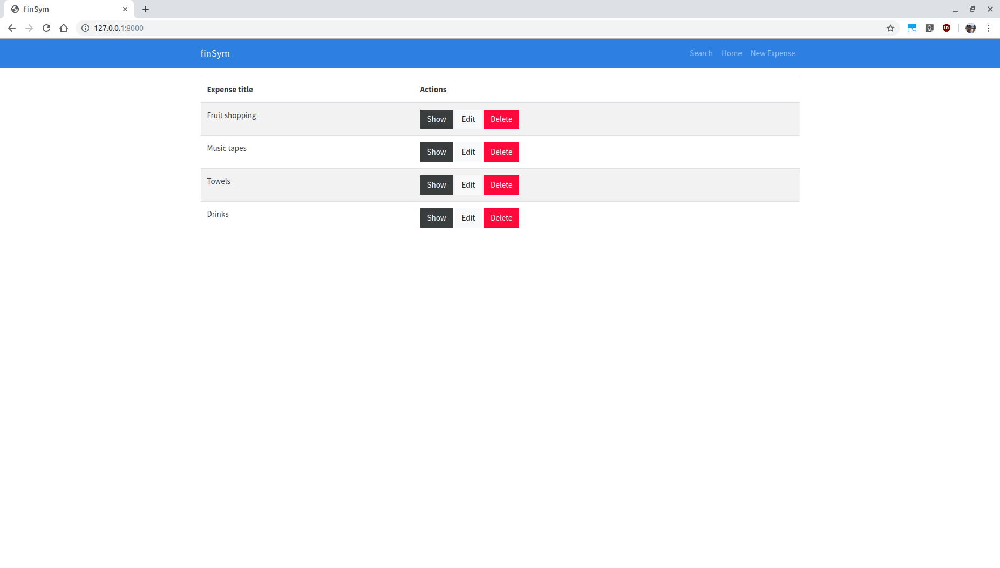
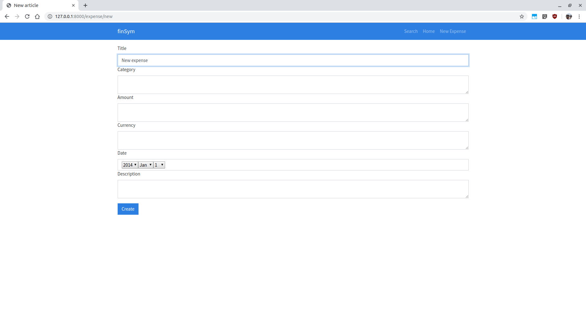
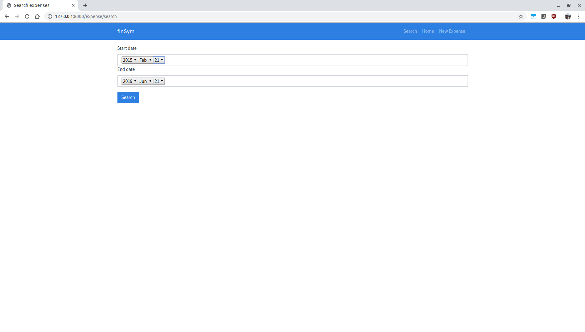

## Description
Financial management application built with Symfony.

Tested on Ubuntu 18.04.2, using the MariaDB database system.

## Setup instructions
- Requires internet connection
- Clone repository
- Open the file `.env` and modify the variable `DATABASE_URL`, such that it looks like this: `DATABASE_URL=mysql://<db_user>:<db_password>@127.0.0.1:3306/expenses`, where `<db_user>` and `<db_password>` are your credentials for the MariaDB database system
- `$ cd` to this project's directory
- Run the server using `./bin/console server:run`
- Open the browser and navigate to http://127.0.0.1:8000
- Enjoy the app!

## Usage instructions
#### Home page:
Upon following the above setup instructions, the home page appears:

This contains a table of expenses. Each row of the table contains the expense name, and has 3 buttons:
- "Show" -> Show more details for the expense
- "Edit" -> Edit the expense fields
- "Delete" -> Delete the expense

At the top of the page there is a blue navigation bar. At the right hand side of the navigation bar there are 3 buttons:
- "Search" -> Show page for searching expenses in the database using only date ranges
- "Home" -> Go back to the home page
- "New Expense" -> Add a new expense

#### Add new expense page
Upon clicking the "New Expense" button on the navigation bar, the following page appears:

Fill in the fields prompted in order to add a new expense. Finally, click the button "Create" at the bottom of the page to add the new expense to the database.

#### Search using date ranges page
Upon clicking the "Search" button on the navigation bar, the following page appears:

This page allows you to search the database for expenses included in a date range (i.e. expenses from a "Start date" until an "End date"). Select the starting and ending date of the date range on this page and click the "Search" button. This will redirect you to a page showing a table of all the expenses in the database, contained within the date range you provided.

## Useful websites
The following tutorials and websites have been very useful towards the development of this application:
- https://www.osradar.com/install-symfony-php-framework-ubuntu-18-04/
- https://symfonycasts.com/screencast/symfony
- https://www.youtube.com/watch?v=t5ZedKnWX9E
- https://symfony.com/doc/current/index.html#gsc.tab=0
- https://www.doctrine-project.org/projects/doctrine-orm/en/2.6/index.html
